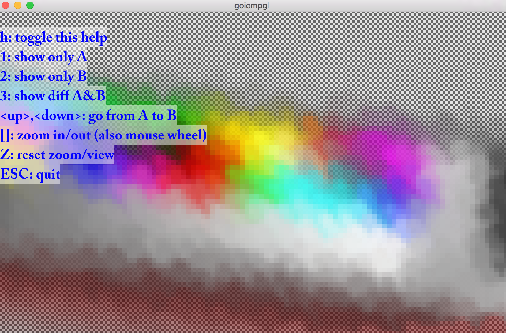

goicmpgl
========

Image comparison written with Go and OpenGL.

Apache license.

Image Comparison:
-----------------

### Features :
  
- Toggle between each image
- Highlight diffs in red
- Morphing of images
- Zoom, pan
- Click to print framebuffer color to console
- Transparency grid

### Synopsis :

- ./goicmpgl img1 img2
- ./goicmpgl url1 url2

### Install :

- go get github.com/go-gl/gl
- brew install homebrew/versions/glfw3 (MAC only)
- go get github.com/go-gl/glfw3
- go get github.com/aubonbeurre/goicmpgl

**NOTE:** To speed-up compilation, consider doing:

- go install -a github.com/go-gl/gl/v4.1-core/gl 
- go install -a github.com/go-gl/glfw3/v3.2/glfw

### Screenshots :

### Credits :

- http://github.com/go-gl
- Font table created with http://www.codehead.co.uk/cbfg/
